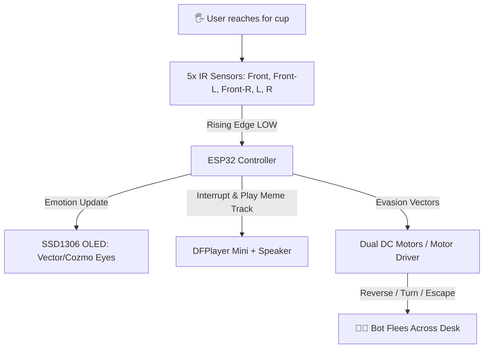

# Thankan-Bot 🎯


## Basic Details
### Team Name: CyberLife


### Team Members
- Team Lead: Gautham D - Saintgits College of Engineering, Kottayam
- Member 2: Muhammed Yaseen N - Saintgits College of Engineering, Kottayam

### Project Description
Thankan-Bot is a chaotic, autonomous motorized cup-carrier robot whose sole purpose is to actively prevent you from drinking your water. The moment you reach out to grab your cup, it detects your hand, shifts its animated OLED eyes to panic or rage, blasts screaming meme audio from its SD card, and speeds away across your desk.

### The Problem (that doesn't exist)
People drink way too much water in peace and stay far too hydrated without sufficient excitement or cardiovascular panic at their desks. Grabbing a cup should not be an easy, mundane routine—it should be an intense high-stakes game of reflex, betrayal, and tactical evasion.

### The Solution (that nobody asked for)
A motorized smart coaster/cup-carrier bot equipped with a 5-sensor IR proximity grid, Anki Vector / Cozmo style animated OLED eyes (0.91" SSD1306), a DFPlayer Mini meme audio blaster, and dual DC motors. When someone reaches for the drink, it executes directional evasive maneuvers while screaming meme audio clips and staring at you with fiery robotic rage.

## Technical Details
### Technologies/Components Used
For Software:
- Languages used: C++ (Arduino)
- Frameworks used: Arduino Core for ESP32
- Libraries used: Adafruit_SSD1306, Adafruit_GFX, DFRobotDFPlayerMini, Wire, SPI, math.h
- Tools used: Arduino IDE, Serial Monitor, Git, GitHub

For Hardware:
- Main components:
  - ESP32 Development Board (30-pin)
  - 5x IR Proximity Sensor Modules (Active LOW)
  - L298N / Dual H-Bridge Motor Driver
  - 2x Micro DC Gear Motors with Rubber Wheels
  - DFPlayer Mini MP3 Player Module + MicroSD Card
  - 0.91" 128x64 SSD1306 I2C OLED Display
  - 8Ω 3W Speaker
  - 7.4V 2S LiPo / 18650 Battery Pack & 5V Buck Converter
  - Custom Cup-Holder Chassis with Caster Wheel
- Specifications:
  - 5-directional IR obstacle detection with rising-edge hardware trigger
  - Non-blocking state machine audio, motion, and animation loop
  - Dynamic procedural eye animations (idle breathing, blinking, happy, surprised, angry, confused)
  - Reverse, angled reverse, and tank turn evasive trajectories
- Tools required:
  - Soldering iron & wire
  - Screwdriver set
  - Hot glue gun / 3D printer
  - Digital multimeter

### Implementation
For Software:
# Installation
```bash
# Clone the repository
git clone https://github.com/yaseenpierson/Thankan-bot.git
cd Thankan-bot
```

Install required libraries in Arduino IDE via Library Manager:
- `Adafruit SSD1306`
- `Adafruit GFX Library`
- `DFRobotDFPlayerMini`

# Run
```bash
# 1. Connect ESP32 via USB
# 2. Select Board: "DOIT ESP32 DEVKIT V1" (or "ESP32 Dev Module")
# 3. Select your COM Port
# 4. Open Bot.ino and click Upload
```

### Project Documentation
For Software:

# Screenshots (Add at least 3)

*Expression Mode: Happy / Idle breathing face with smile rendered on SSD1306 OLED*


*Expression Mode: Surprised / Scared eyes triggered when a hand approaches directly from the front*


*Expression Mode: Angry eyes with furrowed eyebrows during tactical evasion maneuver*

# Diagrams

*System Architecture & Decision Workflow: 5x IR Proximity Grid -> ESP32 Non-blocking State Machine -> OLED Eye Expressions + DFPlayer Meme Audio + Dual Motor Evasion*



For Hardware:

# Schematic & Circuit

*Circuit connections between ESP32, 5x IR sensors, DFPlayer Mini, OLED, and Motor Driver*


*Hardware schematic and wiring diagram*

#### Pin Connection Schema:
| Module | Module Pin | ESP32 GPIO | Description |
|---|---|---|---|
| **Motor Driver** | IN1 | GPIO 25 | Left Motor Forward |
| **Motor Driver** | IN2 | GPIO 26 | Left Motor Reverse |
| **Motor Driver** | IN3 | GPIO 27 | Right Motor Forward |
| **Motor Driver** | IN4 | GPIO 14 | Right Motor Reverse |
| **IR Front** | OUT | GPIO 32 | IR1 (Center Front Sensor) |
| **IR Front-Left** | OUT | GPIO 33 | IR2 (Front Left Sensor) |
| **IR Front-Right** | OUT | GPIO 34 | IR3 (Front Right Sensor) |
| **IR Left** | OUT | GPIO 35 | IR4 (Left Side Sensor) |
| **IR Right** | OUT | GPIO 13 | IR5 (Right Side Sensor) |
| **DFPlayer Mini** | TX | GPIO 16 | Serial RX2 on ESP32 |
| **DFPlayer Mini** | RX | GPIO 17 | Serial TX2 on ESP32 (via 1kΩ) |
| **SSD1306 OLED** | SDA | GPIO 21 | I2C Data |
| **SSD1306 OLED** | SCL | GPIO 22 | I2C Clock |

# Build Photos
*All components: ESP32, 5x IR sensors, DFPlayer Mini, 128x64 OLED, motor driver, DC gear motors, speaker, battery*


*Assembling the chassis, mounting 5-directional IR sensor perimeter, and wiring motor driver*


*Final Thankan-Bot assembly with cup holder platform and animated OLED face*

### Project Demo
# Video
[https://drive.google.com/file/d/1OBb7Ue-YaubfuzuwmgnZghm4_YXmT3aV/view?usp=sharing]
*Demo video showing user reaching for water, Thankan-Bot's eyes changing from happy to panic, blasting meme audio, and speeding away*

# Additional Demos
*Documentation throughout the project*
*All the behind the scenes videos are here!"
https://drive.google.com/drive/folders/1rkOPIKH-pm-439sFepw7gMlXd4NHLRVs?usp=drive_link


## Team Contributions
- Gautham D: Chassis design, mechanical cup-holder assembly, power distribution, motor driver wiring, and hardware evasion testing.
- Muhammed Yaseen N: ESP32 firmware architecture, OLED eye procedural animation engine (Vector/Cozmo expressions), DFPlayer Mini audio integration, and 5-way IR threat matrix.

---
Made with ❤️ at TinkerHub Useless Projects 


